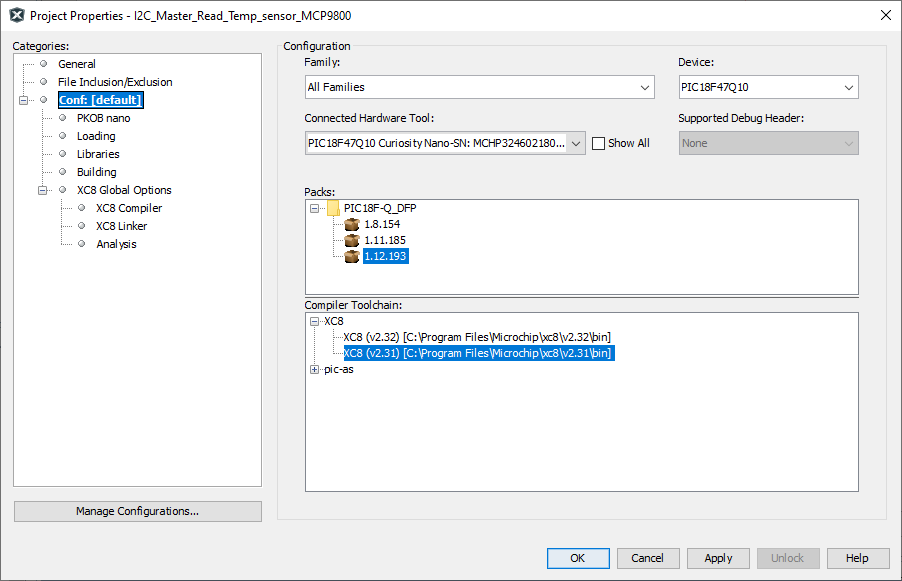

<!-- Please do not change this logo with link -->

# PIC18F47Q10 I2C Host Write DAC

## Objective
This repository contains an example of bare-metal source code for I2C as described in [TB3281 - Getting Started with I2C Using MSSP on PIC18](http://ww1.microchip.com/downloads/en/Appnotes/Getting_Started_With_I2C_Using_MSSP_on%20PIC18_90003281A.pdf) document from Microchip. <!-- This link has to be updated, once the tech brief goes live! -->

The PIC18F47Q10 configured in I2C Host Mode using the MSSP1 peripheral and performing write operations. This example will use the client [TC1321](https://ww1.microchip.com/downloads/en/devicedoc/21387c.pdf), an 10 bit Digital-to-Analog converter (DAC), addressed in 7-bit mode.

## Related Documentation

- [TB3281 - Getting Started with I2C Using MSSP on PIC18](http://ww1.microchip.com/downloads/en/Appnotes/Getting_Started_With_I2C_Using_MSSP_on%20PIC18_90003281A.pdf) <!-- This link has to be updated, once the tech brief goes live! -->
- [PIC18-Q10 Product Family Page](https://www.microchip.com/design-centers/8-bit/pic-mcus/device-selection/pic18f-q10-product-family)
- [PIC18F47Q10 Data Sheet](http://ww1.microchip.com/downloads/en/DeviceDoc/40002043D.pdf)
- [TC1321 - 10-Bit Digital-to-Analog Converter with Two-Wire Interface](https://ww1.microchip.com/downloads/en/devicedoc/21387c.pdf)
- [PIC18F47Q10 Code Examples on GitHub](https://github.com/microchip-pic-avr-examples?q=pic18f47q10-cnano&type=&language=)

## Software Used

- MPLAB� X IDE 5.50.0 or newer [(MPLAB� X IDE 5.50)](https://www.microchip.com/en-us/development-tools-tools-and-software/mplab-x-ide?utm_source=GitHub&utm_medium=TextLink&utm_campaign=MCU8_MMTCha_MPAE_Examples&utm_content=pic18f47q10-cnano-i2c-read-write-temp-sensor-bare-github)
- MPLAB� XC8 2.32.0 or newer compiler [(MPLAB� XC8 2.32)](https://www.microchip.com/en-us/development-tools-tools-and-software/mplab-xc-compilers?utm_source=GitHub&utm_medium=TextLink&utm_campaign=MCU8_MMTCha_MPAE_Examples&utm_content=pic18f47q10-cnano-i2c-read-write-temp-sensor-bare-github)
- Microchip PIC18F-Q Series Device Support 1.12.193 or newer [(packs.download.microchip.com/)](https://packs.download.microchip.com/)

## Hardware Used

- Curiosity Nano Base for Click Boards™ [(AC164162)](https://www.microchip.com/Developmenttools/ProductDetails/AC164162)
- PIC18F47Q10 Curiosity Nano [(DM182029)](https://www.microchip.com/Developmenttools/ProductDetails/DM182029)
- PICkit™ Serial I2C™ Demo Board [(PKSERIAL-I2C1)](https://www.microchip.com/DevelopmentTools/ProductDetails/PKSERIAL-I2C1)

## Setup

The PIC18F47Q10 Curiosity Nano Development Board is used as the test platform.

 

The following configurations will be made for this project:
- Clock
	- Oscillator Select: HFINTOSC
	- HF Internal Clock: 4 MHz
	- Clock Divider: 1
- MSSP1
	- Serial Protocol: I2C
    - Mode: Host
    - I2C Clock Frequency: 100000
- Watchdog Timer: disabled
- Low-voltage Programming: disabled

|Pin           | Configuration      |
| :----------: | :----------------: |
|RB1 (SCL1)    | With Pull Up       |
|RB2 (SDA1)    | With Pull Up       |

## Operation
1. Connect the board to the PC.

2. Open the *pic18f47q10-cnano-i2c-write-dac-bare.X* project in MPLAB® X IDE.

3. Configure the project properties:
    - Right click on the project and click *Properties*
    - Select the device pack in the *Packs* tab
    - Select the *PIC18F47Q10 Curiosity Nano* (click on the SN) in the *Hardware Tool* tab
    - Select the compiler version in the *Compiler Toolchain* tab
    - Click *OK* to save the changes
    
 

4. Program the project to the board: right click on the project and click *Make and Program Device*

## Summary

This project is an illustration for a basic use case for writing to a DAC using MSSP1.

